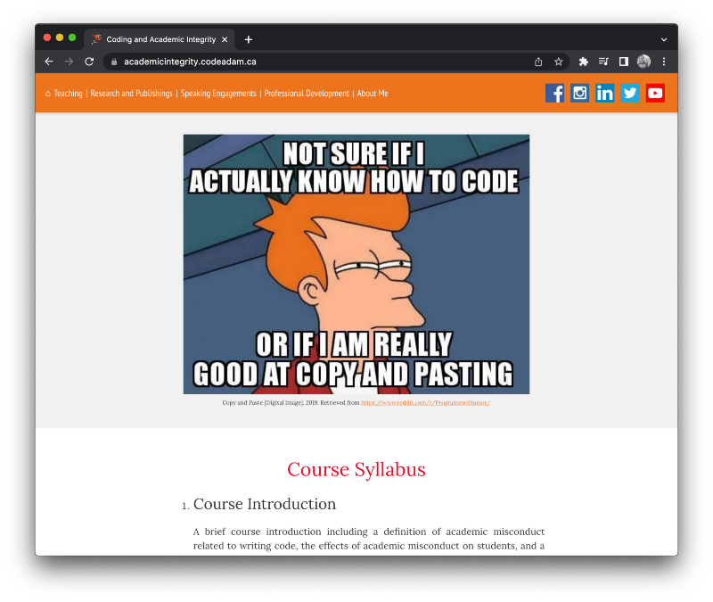

# Academic Integrity online Course

A small online learning module on coding and academic integrity. 

> The full course can be viewed at:  
> [https://academicintegrity.codeadam.ca/](https://academicintegrity.codeadam.ca/)

## Requirements:

* [Visual Studio Code](https://code.visualstudio.com/) or [Brackets](http://brackets.io/) (or any code editor)

